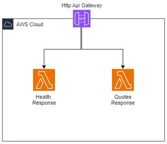

# Lambda-api-gateway-serverless-terraform

This project is a serverless application built using AWS Lambda, API Gateway, and Terraform. It provides a scalable and cost-effective solution for handling API requests.

## Getting Started

To get started with this project, follow the steps below:

1. Clone the repository: `git clone https://github.com/your-username/lambda-api-gateway-serverless-terraform.git`
2. Navigate to the project directory: `cd lambda-api-gateway-serverless-terraform`
3. Deploy the infrastructure using Terraform: `terraform apply`
5. Test the API endpoints using a tool like Postman or cURL.

## Project Structure

The project structure is as follows:

```
.
├── src
│   
├── .gitignore
├── backend.tf
├── main.tf
├── providers
├── outputs.tf
├── variable.tf
└── README.md
```

## Design



Please refer to the above diagram for an overview of the project's architecture and component interactions.

## Contributing

Contributions are welcome! If you have any ideas, suggestions, or bug reports, please open an issue or submit a pull request.

